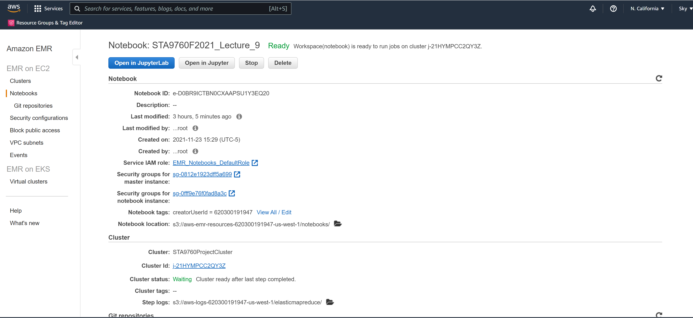
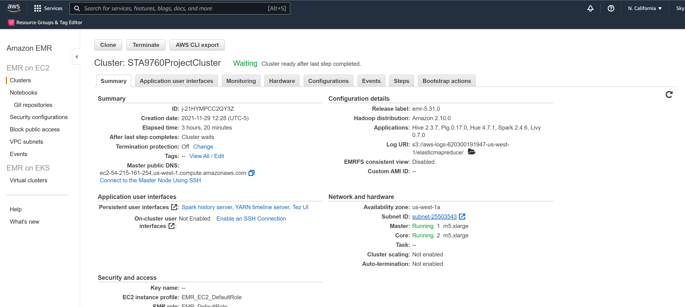

# Yelp-Analysis
# Analyzing 10Gb of Yelp Reviews Data

This project I will analyze a subset of Yelp's business, reviews and user data. 
This dataset comes to us from [Kaggle](https://www.kaggle.com/yelp-dataset/yelp-dataset) 
I have taken the desparete 1 hour to upload data from Kaggle to S3...
After the long wait, I finally got what I need there, and by applying cluster and notebook from AWS, I can use the uploaded data...
s3 bucket:s3://sta9760yelpdatasetsky/yelp/yelp_academic_dataset_business.json

## Cluster and Notebook Configs

